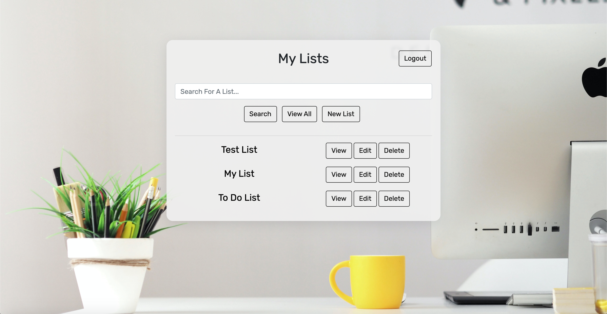

# Ulitmate List App



## Description 
This application allows the user to create an account, make lists, and edit those lists.  The lists are saved to a database and can be accessed from any where as long as the user remembers their username and password.  The application is also mobile responsive and works well on both desktop and moblie devices. This application is built on an express server, MongoDB database, and uses ejs templating on the front end.  Passport.js was used to create the authentication process for the user.     

#### Built With
Node.js
Express.js
MongoDB
Mongoose.js
Bootstrap 
EJS templates

## Table of Contents
  
* [Installation](#installation)
* [Usage](#usage)
* [License](#license)
* [Questions](#questions)
  
  
## Installation
### View the Project Live
If you would like to view this project live, you can use the link Below.
https://ultimatelistapp.herokuapp.com/

### Run the Project Locally
** This project requires node.js and mongoDB to run locally so make sure those are installed on your device.  **

* Step 1: Navigate to the directory you want to store the project. Clone this your repository to your local computer using the command below. 
```bash
git clone https://github.com/MarkMulligan97/readmeGenerator.git
```

* Step 2: Use the command line to navigate to the directory that you cloned the project.
Example:
```bash
cd directory/projectdirectory
```

* Step 3: Install the npm package dependencies from the package.json file.
```bash
npm install
```

* Step 4: Make sure mongoDB is set up on your computer and a local instance is running for your program to interact with. 
[mongoDB documentation](https://docs.mongodb.com/manual/installation/) 

* Step 5: In the app.js file (line 30), update the mongoose.connect function so that it uses you local environment. 
```javascript
mongoose.connect('mongodb://localhost:27017/ultimatelistDB', ...
```
* Step 6: Update the secret in app.js file (line 20).  Replace the process.env.SECRET with a String of your choosing.  
```javascript
app.use(session({
    secret: process.env.SECRET,
    resave: false,
    saveUninitialized: false
}));
```

* Step 7: While in the project directory, run the program using node using the command below. Open you browser and navigate to localhost:3000 to view the application.
```bash
node app.js
```  

## Usage 
#### Make An Account
1.  On the home page, click the 'Make Account' button.
2.  Create a user name and password and submit the form.  That's it, your account is created.  


#### Create A New List 
1.  After logining in, click the create list 'New List' button.
2.  Fill out the input to create a list title.  

#### Add Items
1.  Simply type in the name of the item you would like to add to the add item section on the list.  
2.  Hit enter or the + button and the item will be deleted from the list.  

#### Delete Items
1.  Click the trash can on the next to the list item you would like to delete.
2.  You can also delete all items in a list by clicking 'Clear Items' on the list page. 

#### Delete lists
1.  On the list index page, click the delete button next to the list you would like to delete.
2.  On the list page, click the trash can icon.

#### Update lists
1.  On the list index page, click edit to rename the list.  
2.  On the list page, click on the list title to edit it.
3.  On the list page, click the pencil to edit list items.  


## Questions
[My Github](https://github.com/MarkMulligan97) || mark.mulligan.jr1@gmail.com

#### How to Contact Me
Feel free to reach out to me if you have any questions about this project.  You can email me using the email listed above or can go to my github page to view my other projects and portfolio.

© Mark Mulligan 2021 All Rights Reserved.